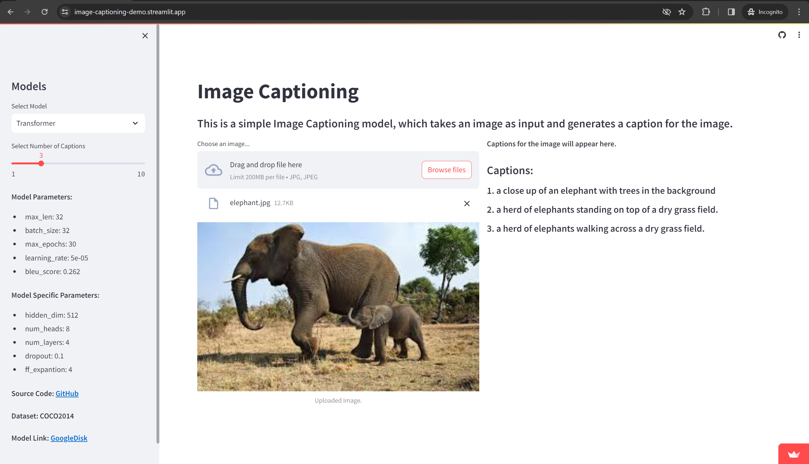

# Image Captioning

Image Captioning is a project that aims to automatically generate descriptive captions for images. It combines computer vision techniques with natural language processing to analyze the content of an image and generate a relevant and coherent caption. This project is useful in various applications such as image indexing, content retrieval, and assisting visually impaired individuals. It utilizes deep learning models and advanced algorithms to understand the visual content of an image and generate accurate and meaningful captions. The project also includes installation instructions, usage guidelines.

## Table of Contents

- [Image Captioning](#image-captioning)
  - [Table of Contents](#table-of-contents)
  - [Demo using streamlit](#demo-using-streamlit)
  - [Installation](#installation)
  - [Usage](#usage)
    - [1. Inference by running `predict.py`](#1-inference-by-running-predictpy)
    - [2. Import predict function from `predict.py` and do inference](#2-import-predict-function-from-predictpy-and-do-inference)
    - [3. You can access directly predict function of each mode](#3-you-can-access-directly-predict-function-of-each-mode)
  - [Features](#features)
    - [Transformer Model](#transformer-model)
    - [Seq2Seq Model](#seq2seq-model)
  - [Notes](#notes)

## [Demo using streamlit](https://image-captioning-demo.streamlit.app/)



You can find demo this project and test it's your self [here](https://image-captioning-demo.streamlit.app/).

## Installation

```bash
git clone https://github.com/ToirovSadi/Image_Captioning.git

cd Image_Captioning
pip install -r requirements.txt
```

- It's recommended to first create a separate python environment before installing all python packages.

## Usage

### 1. Inference by running `predict.py`

```bash
python predict.py --model_name='model_name' --image_path=path/to/your/image --num_captions=3
```

### 2. Import predict function from `predict.py` and do inference

```python
from predict import predict as predict_caption

predict_caption(
  model_name='model_name',
  image_path='path/to/your/image',
  num_captions=3,
)
```

### 3. You can access directly predict function of each mode

```python
from src.models.seq2seq.predict_model import predict

predict(
  model='model.ckpt',
  img='your/img/path',
  num_captions=3,
)
```

- Image format: Any, but in demo it's only `jpg`
- Model names: `transformer`, `seq2seq`, `seq2seq_1`

## Features

### Transformer Model

- Encoder: pre-trained resnet101
- Decoder: Transformer

### Seq2Seq Model

- Encoder: pre-trained resnet101
- Decoder: LSTM

## Notes

- The only difference between `seq2seq` and `seq2seq_1` model is that, `seq2seq_1` was trained with weight_decay=0.01 and `seq2seq` without weight_decay.

- All models were trained only on `COCO2014` dataset.

- Most of the documentation for the code were written using `Copilot`.